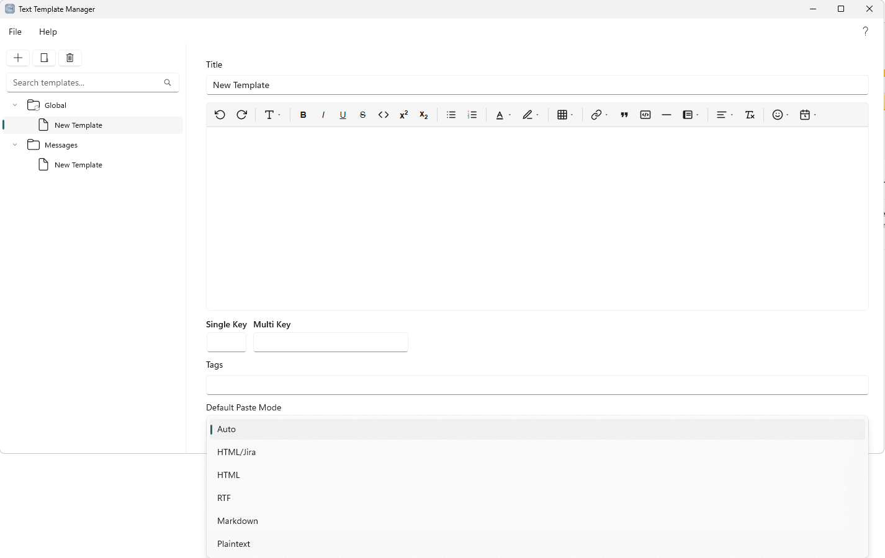
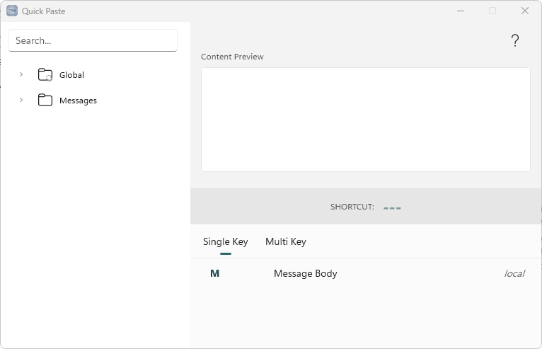
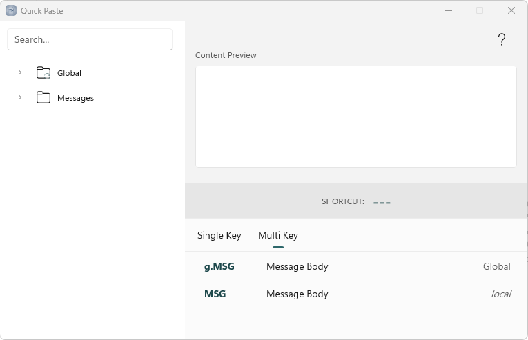
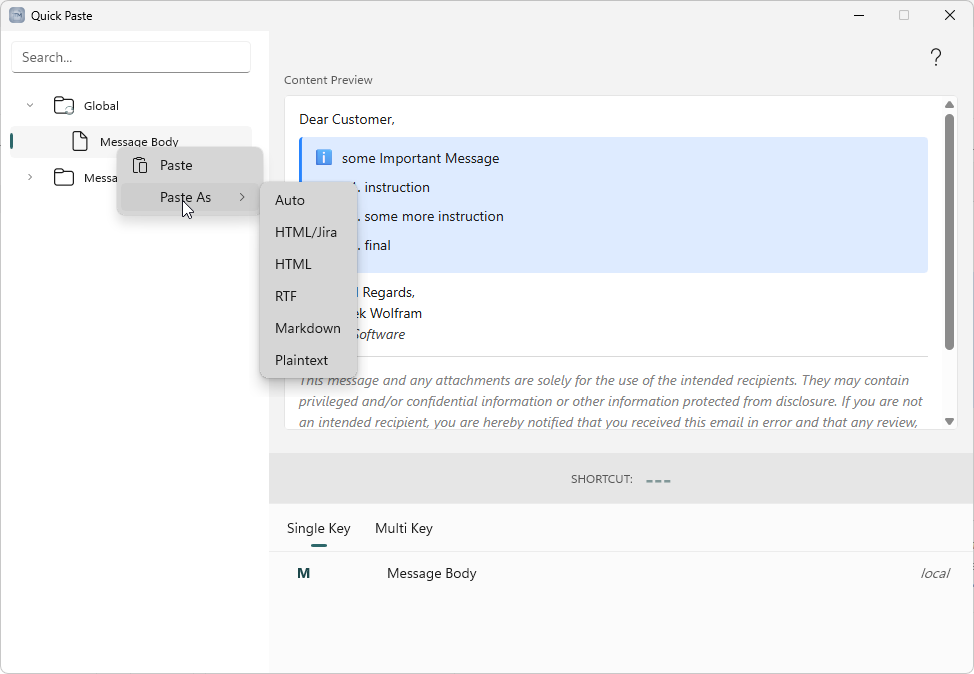
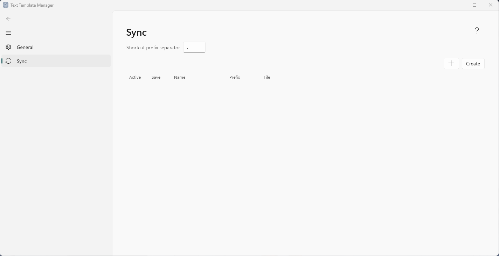
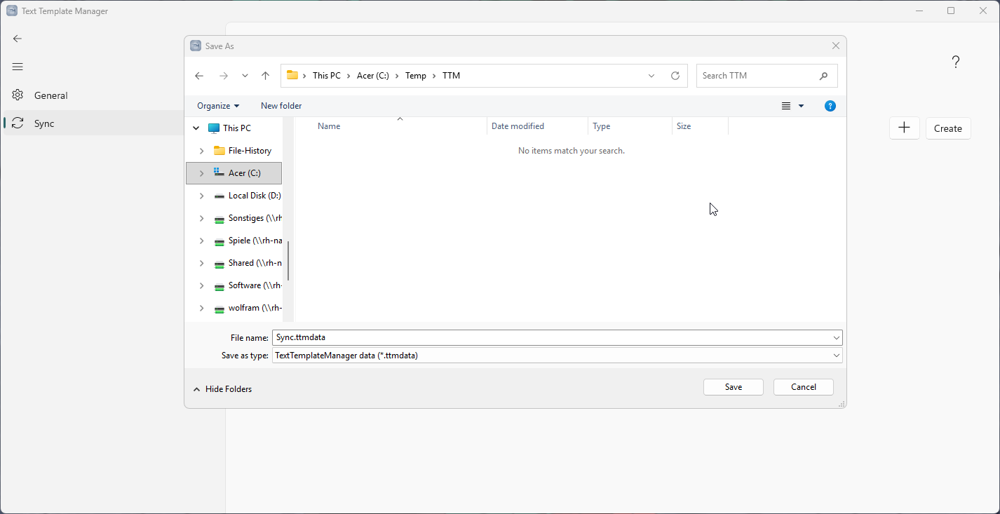
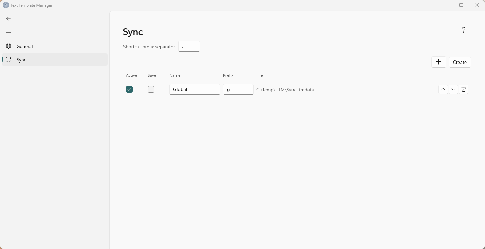
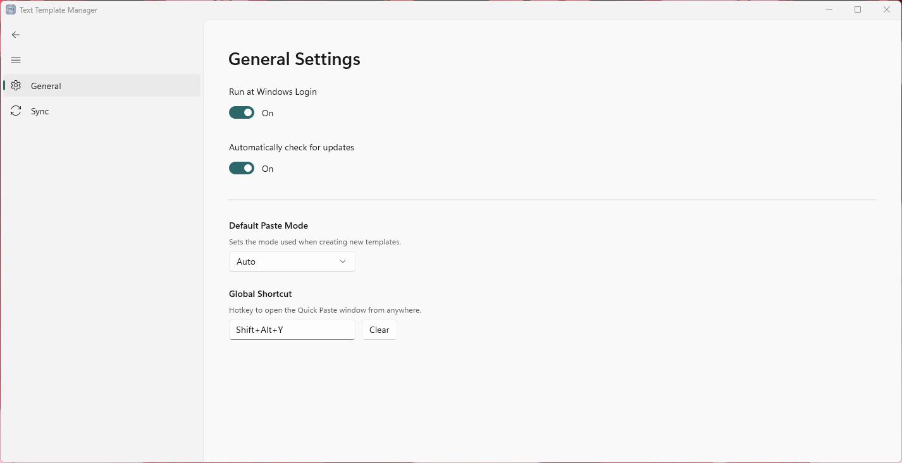

## Introduction

Text Template Manager is a Windows application for storing reusable pieces of text — email
replies, code snippets, standard responses, boilerplate — and inserting them into any other 
application with a keystroke. Templates are organized in folders, can be given keyboard-
shortcuts, and can optionally be shared with a team through a synchronized file.

This handbook describes every feature of the application. Throughout, a menu path is written in
the form **Menu ▸ Item** (for example, **Settings ▸ General**), and keyboard input is shown in
bold (for example, **Alt**). The installed version is shown under **Help ▸ About**.

---

## The main window

The main window is divided into two panes:

- The **left pane** contains the template tree and a search box. The tree holds your folders and 
  templates, including any synchronized folders, which are pinned to the top.
- The **right pane** shows the editor for the currently selected template, or the title field for 
  a selected folder. When nothing is selected, it shows a placeholder.

The toolbar above the tree provides buttons to add a template, add a folder, and delete the 
selected item. The menu bar provides the **File** and **Help** menus, and the quick-help button
in the top-right corner opens a short in-app reference.

---

## Templates and folders

### Creating items

Use the toolbar to add a new template or folder. New items are placed relative to the current 
selection: inside the selected folder, alongside a selected template, or at the top level when 
nothing is selected. New items are given a unique default name, which you can change at any time.

### Organizing the tree

Drag items to reorder them or to move them between folders. Folders may contain both templates 
and other folders; a template is always a leaf and can never contain other items — dropping an
item onto a template places it as a sibling directly below. Expansion and 
selection are preserved as you work.

To move an item out to the top level, drag it there or right-click it and choose **Move to Root**.
Click an empty area of the tree, or press **Esc**, to clear the selection — with nothing selected,
new templates and folders are created at the root.

### The template editor

Selecting a template opens it in the rich-text editor, which supports bold, italic, underline, 
strikethrough, text and highlight colors, headings, bulleted and numbered lists, tables, and 
callout panels. Changes are saved automatically a short time after you stop typing, so there is 
no separate save step.

.png>)

### Callout panels

The **Panel** button on the editor toolbar wraps the current block in a colored callout, in one 
of five styles: **Info**, **Note**, **Success**, **Warning**, or **Error**. Choosing the panel's 
current style again removes the panel; choosing a different style changes it.

Panels adapt to whichever paste mode you use (see *Paste modes*): they become native panels in 
Atlassian Jira, colored boxes in email and word processors, and a labeled quote in Markdown.

### Template properties

Each template exposes the following properties:

- **Title** — the display name, shown in the tree and searchable.
- **Tags** — optional, comma-separated keywords that are also included in search.
- **Default paste mode** — the format used when the template is pasted (see below).
- **Single-key shortcut** and **Multi-key shortcut** — optional shortcuts for the Quick Paste 
  window (see *Keyboard shortcuts and conflicts*).

### Paste modes

The paste mode determines how a template is placed on the clipboard and inserted into the target 
application:

The modes are listed below in the order they appear in the app.

| Mode | Description |
| --- | --- |
| Auto | Chooses the most suitable format for the target application — the most broadly compatible choice. Callout panels render as colored boxes. |
| HTML/Jira | HTML tuned for Atlassian Jira: callout panels and text colors are preserved so Jira's comment editor rebuilds them natively (colors snap to Jira's nearest palette color). |
| HTML | HTML markup. Callout panels are rendered as colored boxes, for broad compatibility with email clients, word processors, and web apps. |
| RTF | Rich Text Format. Callout panels are rendered as shaded, bordered boxes. |
| Markdown | Markdown source text. Callout panels become a labeled blockquote. |
| Plaintext | Unformatted text only. |

---

## Quick Paste

Quick Paste is a compact window that lets you insert a template into whichever application you 
were using, without leaving the keyboard.

Press the configured global hotkey (see **Settings ▸ General**) from any application to open it.
Quick Paste remembers the application you came from and returns focus to it when a template is 
pasted.

### Inserting a template

- **Single-key shortcut** — with the search box empty, press the key assigned to a template to 
  paste it immediately. If the same key is assigned in more than one area, the local template 
  takes precedence, followed by synchronized folders in their configured order.
- **Multi-key shortcut** — hold **Alt**, type the shortcut, and release **Alt** to paste.
  Shortcuts in synchronized folders are prefixed with the folder's prefix (for example, 
  `and-msg`). The characters `-`, `_`, and `.` are permitted as separators. Press **Backspace** 
  while holding **Alt** to correct a mistyped entry.
- **Paste as plain text** — end a multi-key entry with **Shift + -** (which produces `_`) to 
  insert the template as unformatted text, regardless of its default paste mode.
- **Search** — type in the search box to filter the tree; matching templates display their folder 
  path. Double-click any template, in either the tree or the shortcut lists, to paste it.

The shortcut lists at the bottom of the window show the available single-key and multi-key 
shortcuts, together with the area each belongs to (a synchronized folder's name, or *local*). 
Switch between them with the **Single Key** and **Multi Key** tabs:

To paste with a format other than the template's default just this once, right-click it (in the 
tree or a shortcut list) and choose **Paste As**:

---

## Keyboard shortcuts and conflicts

Every shortcut belongs to an **area**. An area is either a specific synchronized folder or the 
set of everything outside synchronization (referred to as *local*).

- A **single-key** shortcut may be reused in different areas. When a key is assigned in more than 
  one area, Quick Paste resolves it by priority: the local template first, then synchronized 
  folders in the order configured in settings. Assigning the same single key twice **within the 
  same area** is a conflict and is not permitted; the application reports it and does not save the 
  duplicate.
- A **multi-key** shortcut is namespaced by its folder's prefix, so identical shortcuts in 
  different folders do not collide. A genuine duplicate within one area is reported and not saved.

Cross-area single-key duplicates are permitted and are shown as an informational note rather than 
an error. When you move a template into an area that already uses its shortcut, the application 
resolves the clash automatically: a duplicate single-key shortcut is removed from the moved 
template, and a duplicate multi-key shortcut receives a numeric suffix (for example, `MSG` 
becomes `MSG1`).

Any outstanding conflicts and notes are listed in a small panel in the top-right of the main 
window. Same-area conflicts must be resolved, so the panel stays until they are; a panel showing 
only cross-area notes can be dismissed with its **×** button.

---

## Synchronization

Synchronization lets several people, or several of your own computers, share the same set of 
templates. A synchronized source is an ordinary template file that is stored in a shared 
location — most commonly a cloud folder such as OneDrive — and surfaced in the tree as a pinned 
folder at the top.

Synchronized files are watched for external changes and reconciled automatically, so edits made 
elsewhere appear without restarting the application.

### Configuring sources

Manage synchronized sources under **Settings ▸ Sync**.

To add a source, click **+** to link a shared file that already exists, or **Create** to make a 
new one — for example in a OneDrive folder so it is shared automatically:

The source then appears as a row, shown in the tree as a pinned folder. Configure it with the 
row's controls (detailed below):

Each source offers the following options:

- **Active** — load the source into the tree as a pinned folder. Clearing this hides the folder 
  without deleting the underlying file.
- **Save** — when enabled, the folder is editable and your changes are written back to the shared 
  file. When disabled, the folder is read-only and the shared file always takes precedence on 
  reload.
- **Name** — the folder's title as shown on this computer. It is set here only; the pinned sync
  folder's name is read-only in the tree.
- **Prefix** — the text that namespaces the folder's multi-key shortcuts (for example, a prefix 
  of `and` turns the shortcut `msg` into `and-msg`). The character joining the prefix and the 
  shortcut is set by the separator field; the permitted separators are `-`, `_`, and `.`.
- **Order** — the up and down arrows set the folder's priority. This priority determines which 
  template wins when a single key is shared across areas, and is applied immediately.

If a source's file cannot be found (for example, it has been moved or is temporarily offline), a 
warning icon is shown next to it. Click the icon to re-link the source to its file. The most 
recently cached contents remain visible in the meantime.

---

## Settings

Open settings from **File ▸ Settings**.

### General

- **Run at Windows login** — starts the application automatically when you sign in to Windows.
- **Automatically check for updates** — periodically checks for a newer release and offers to 
  install it. See *Updates*.
- **Default paste mode** — the paste mode applied to newly created templates.
- **Global shortcut** — the hotkey that opens the Quick Paste window from any application. Click 
  the field and press the desired key combination to change it.

### Sync

Manage synchronized sources, as described in *Synchronization*.

---

## Backup and export

- **File ▸ Save Backup** and **File ▸ Load Backup** export and import your entire template tree 
  as a single file.
- Right-clicking a folder and choosing **Export** saves just that folder and its contents to a 
  standalone file, which is useful for creating a new shared source or sharing a subset of 
  templates.

---

## Updates

When automatic update checking is enabled, the application checks for a newer release on startup 
and periodically thereafter, and you can also check on demand from **Help ▸ Check for Updates**.

When a newer version is available, it is downloaded in the background and an **Update now** button 
appears in the top-right corner of the main window. You are prompted to install immediately or to 
defer; deferring keeps the button available and prompts again on the next start. Installing closes 
the application, applies the update silently, and reopens it.

---

## Keyboard reference

| Context | Input | Action |
| --- | --- | --- |
| Main window | **Delete** | Delete the selected item (with confirmation). |
| Main window | **Ctrl + C** | Copy the selected template in its default paste mode. |
| Main window | **Esc** | Clear the current selection. |
| Quick Paste | *key* | Paste by single-key shortcut (search box empty). |
| Quick Paste | **Alt** + *keys* | Paste by multi-key shortcut; release **Alt** to insert. |
| Quick Paste | **Alt** + **Backspace** | Correct the current multi-key entry. |
| Quick Paste | **Esc** | Close the Quick Paste window. |

Additional actions are available from the right-click menu, including **Duplicate**, **Copy**,
and **Copy As** for templates, **Export** for folders, and **Move to Root** for nested items.

---

## Data and file locations

Application data is stored per user under:

`%LocalAppData%\Marflow Software\TextTemplatesManager`

This folder contains your template data, application settings, and synchronization configuration.
Downloaded update installers are staged in an `installer` subfolder. Shared synchronization files 
are stored wherever you place them, and are not kept in this folder.

---

## Support

For questions, permission requests, or to report an issue, contact 
`contact@kmarflow.com`, or visit the project on GitHub via **Help ▸ Go to GitHub**.
